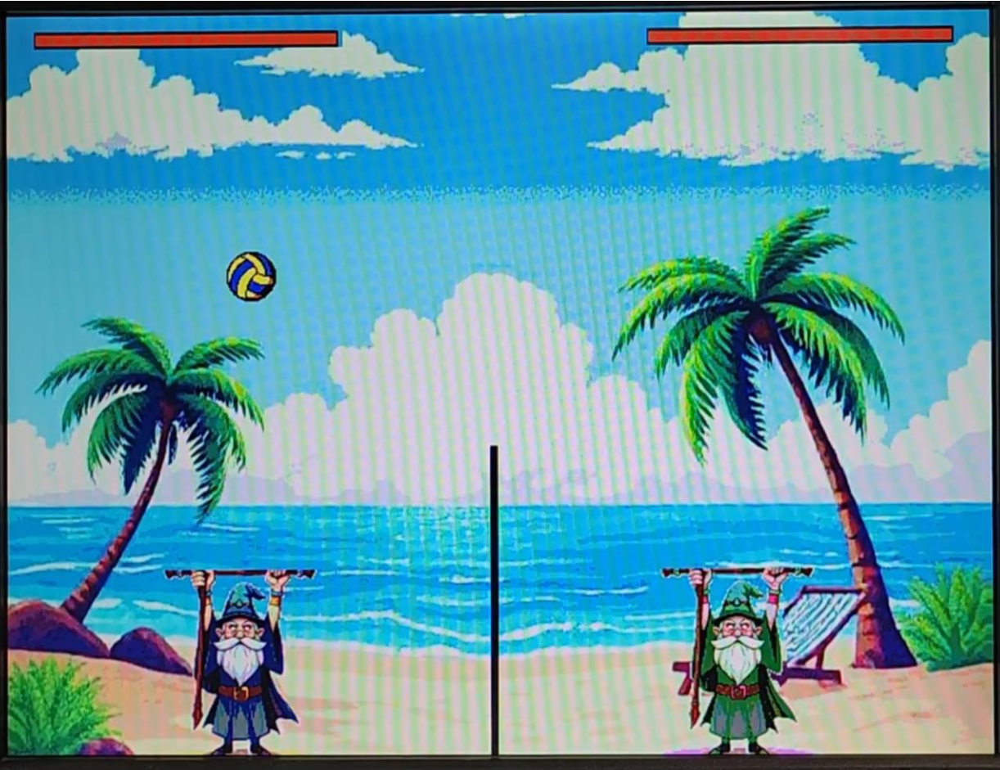

# 🧙‍♂️ Wizard Volleyball Game on VGA Monitor  
**A 2-Player Retro Game Built on FPGA with SystemVerilog**

## 📌 Overview
This project recreates a classic volleyball game inspired by *Blobby Volley*, implemented entirely on an FPGA using the DE1-SoC board and displayed through a VGA monitor. The two players — stylized as wizards — battle it out using push-button inputs, realistic ball physics, and a retro-styled graphical interface.

## 🎮 Gameplay Highlights
- 2-player game controlled via onboard push-buttons
- Real-time ball physics including gravity, momentum transfer, and collisions (walls, net, players, ground)
- Health bars act as life indicators; the first player to lose all health loses the match
- Screen saver mode displays a scenic beach background

## 🛠️ System Features
- **Fully custom VGA graphics** using sprite ROMs (.mif files) for:
  - Wizards
  - Volleyball
  - Game background
  - Game-over screen
- **Integer-based physics engine**:
  - Cartesian (x, y) coordinates for ball position
  - Independent velocity registers (Vx, Vy)
  - Collision detection and bounce logic
- **Optimized resource usage**:
  - Dual-port ROMs for sprite rendering
  - Health bars instead of numerical scores to save memory
- **Frame timing**:
  - Custom tick counters to ensure smooth visuals at 25MHz VGA clock rate

## 🧪 Development & Testing
Development followed an iterative cycle:
- Generate and test graphics using Python scripts
- Convert images to .mif format for ROM instantiation
- Code → Recompile → Visually inspect output on VGA
- Debug through display behavior due to visual nature of the game

## 🧩 Technical Modules
- **VGA Clock Generator (25 MHz)**
- **VGA Controller**
  - Draws sprites based on pixel coordinates
  - Mux logic to layer background, wizards, ball, and health bars
- **Top Module**
  - Handles user inputs and connects components

## 📂 Tools & Assets
- Quartus Prime
- SystemVerilog
- Python (PIL) for .mif generation
- AI & image editing tools for sprite/background creation

## 📈 Challenges Overcome
- Masking transparency in sprites to show background
- Integer-only physics (no floating-point/trigonometry)
- Realistic motion tuning by trial-and-error
- Efficient memory usage within limited FPGA resources

## 🔧 Possible Enhancements
- Use PS/2 keyboard for better player control
- Add sound effects via PWM and GPIO audio jack
- Power-up modes or smarter AI opponent

